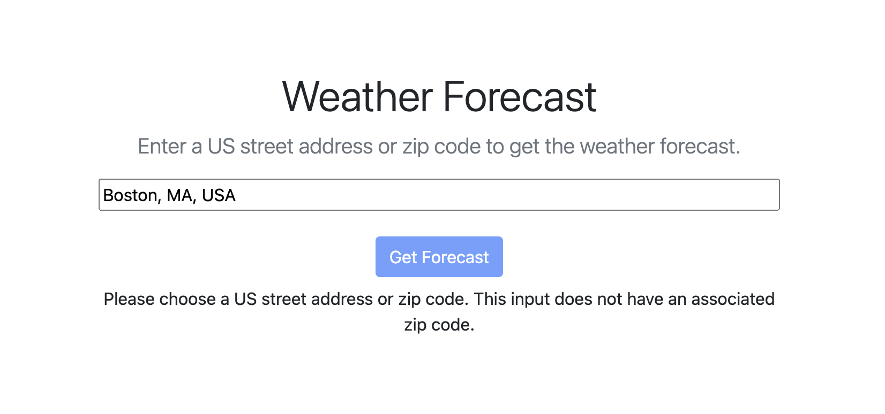

# Weather Forecast

This is a toy app that retrieves weather data given a US street address or zip code. The backend caches forecast data by zip code for 30 minutes and will indicate whether or not the data was retrieved from cache or via API. 

## Setup

This app uses Ruby 3.3.6, Rails 6.1.7, Redis, and Node 22.11.0. Ensure that you have all installed before proceding. No relational database creation is necessary as no data is stored aside from temporaily cached data. 

You will need to obtain an API key for [Google Maps](https://console.cloud.google.com/google/maps-apis/credentials) with the Places API enabled. You'll also need a key for [Weather API](https://www.weatherapi.com/my/). 

1. Create an `.env` file in the root directory and set the variables `GOOGLE_MAPS_API_KEY` and `WEATHER_API_KEY` with the values obtained above
1. Run `bundle` to install Ruby gems
1. Run `yarn` to install NPM packages
1. Turn on dev caching with `rails dev:cache`
1. Start Redis with `redis-server`
1. Run `rails s` to start server
1. Navigate to `localhost:3000` to use app

## Tests

This app uses [RSpec](https://rspec.info/) for unit tests (POROs, services, and controller) and [Cypress](https://www.cypress.io/) for integration tests. 

To run RSpec tests: `rspec`

To run Cypress tests: `yarn cypress open` 

## Third-party APIs used

Data from the Google Maps Places API populates the address dropdown in order to validate location input and obtain zip codes from US street addresses. 

The zip code obtained from the Google Maps Places API is then sent to two APIs provided by Weather API: 
* `current` in order to obtain the current temperature 
* `forecast` in order to obtain the high and low temperatures for the next four days. 

## Objects and services

This app has three main object classes: `WeatherResult`, `WeatherApiService`, and `DailyForecast`. 

The `DailyForecast` is a PORO initialized with:
* `date` (string)
* `high` (string)
* `low` (string)

The `WeatherResult` is a PORO initialized with: 
* `zip_code` (string)
* `cache_hit` (boolean)
* `current_temperature` (string)
* `forecasts` (array of `DailyForecast` instances). 

The `WeatherApiService` is a service wrapping the Weather API. It is initialized with a `zip_code` and exposes one public method, `weather_result`, which returns a `WeatherResult` instance. One of the private methods, `fetch_weather_data`, uses low-level Rails caching in order to cache weather data obtained from calls to the Weather API for 30 minutes. 

## Known limitations

**Missing Zip Code**: Since a zip code is what is sent to the Weather API (as opposed to coordinates or city name), any Google Maps Places API result that is missing a zip code will result in an error message: 

**No Exception Handling**: In addition, there is no handling for exceptions raised during the external request to the Weather API. 

**Global Zip Codes**: Weather API supports zip codes for US, UK, and Canada. It seems to have some inconsistent support for zip codes outside of these areas as well. In the case that Weather API does not return data for a specific zip code, the user will see the following:

## Next steps

* Add exception handling in HTTP call in WeatherApiService
* Add `success` attribute in WeatherApiService that can be queried in controller 
* Extract functionality from `index` method in controller and use `create` and `show` during form submission and rendering
* Extract logic from `index.html.erb` and move to controller after implementing previous step
* Potentially extract pieces of html into partials (particularly error html)
* Potentially switch out jQuery for a [Stimulus JS](https://github.com/rwarbelow/weather-forecast/commit/0e5ba1ce1a8dd11318c2208d9c42fc8cd395a339) controller. I originally used a Stimulus controller (see [this commit](https://github.com/rwarbelow/weather-forecast/commit/0e5ba1ce1a8dd11318c2208d9c42fc8cd395a339)) given that it pairs nicely with Rails, but removed it in favor of trying out how jQuery would work in this app. If the functionality were to grow, I would lean toward using Stimulus again.
